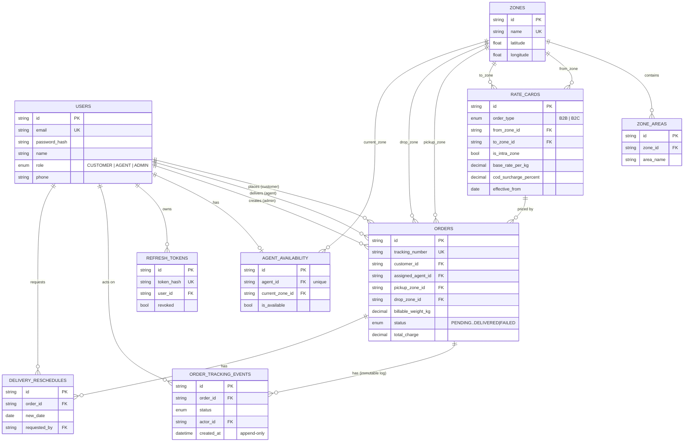

# LastMile — Last-Mile Delivery Tracker

> Production-grade last-mile delivery tracking platform built with Node.js, PostgreSQL, and Next.js 14.

[](server/)
[](client/)
[](server/prisma/)
[](#)

---

## 📑 Contents

- [Features](#-features)
- [Tech Stack](#-tech-stack)
- [Quick Start](#-quick-start)
- [Environment Variables](#️-environment-variables)
- [API Reference](#-api-reference)
- [Rate Engine](#-rate-engine)
- [Database Schema](#-database-schema)
- [Project Structure](#-project-structure)
- [Deployment](#-deployment)
- [Security Decisions](#-security-decisions)

---

## ✨ Features

### Dynamic Rate Engine
- **DB-driven rate cards** — no hardcoded rates, all stored in PostgreSQL
- **Volumetric weight calculation**: `(L × B × H) / 5000`
- **Billable weight**: `max(actual, volumetric)`, rounded UP to nearest 0.5 kg
- **B2B / B2C pricing** with separate rate cards per zone pair
- **COD surcharge** applied on billable charge
- **Zone detection** — area names matched via `ILIKE '%area%'` (case-insensitive partial match)

### Intelligent Auto-Assignment
- **Zone-first matching** — finds available agents in the pickup zone
- Fallback to any available agent system-wide if the zone has no free agents
- **Manual override** by admin with full audit trail
- **Auto-release** — agent set available automatically on DELIVERED or FAILED

### Order Lifecycle Management
- Strict status machine: `PENDING → PICKED_UP → IN_TRANSIT → OUT_FOR_DELIVERY → DELIVERED / FAILED`
- **Immutable event log** — tracking events are append-only (no update/delete ever issued)
- Every event stores actor ID + role for full attribution
- **Failed delivery recovery** — customer-facing reschedule flow with idempotency guard

### Authentication & Security
- JWT access token (15 min) + refresh token (7 days, httpOnly cookie)
- **Server-side refresh token rotation** with SHA-256 hashing in DB
- True server-side logout that actually invalidates tokens
- Role-based access control: ADMIN, AGENT, CUSTOMER

### Admin Dashboard
- Live stats: orders today, revenue today / week / month, agents available, revenue at risk
- Recharts bar + line charts for order status distribution and revenue trends
- Leaflet.js live map showing active orders and agent locations by zone
- Rate card management table (CRUD)
- Zone area management with add / remove

---

## 🛠 Tech Stack

| Layer | Technology |
|-------|-----------|
| Backend runtime | Node.js 20 + Express 4 |
| Language | TypeScript (ES2020, commonjs) |
| ORM | Prisma 5 |
| Database | PostgreSQL 15 (Docker locally, Railway in production) |
| Cache | **Redis 7** (ioredis) — rate card cache, LRU eviction, graceful degradation |
| Auth | JWT + bcrypt + server-side refresh token rotation |
| Email | Nodemailer (graceful degradation — API never fails on email error) |
| Validation | Zod |
| Frontend | Next.js 14 (App Router) |
| Styling | Tailwind CSS |
| Animations | Framer Motion |
| Charts | Recharts |
| Maps | Leaflet.js |
| Toasts | Sonner |

---

## 🏃 Quick Start

### Prerequisites
- Node.js 20+
- Docker Desktop (for PostgreSQL)

### 1. Clone & Setup

```bash
git clone https://github.com/anshumanvatsa/Last-Mile-Delivery-Tracker.git
cd Last-Mile-Delivery-Tracker
```

### 2. Start Database + Cache

```bash
docker-compose up -d
```

This starts **PostgreSQL 15** and **Redis 7** together. Redis is used to cache rate card lookups — reduces DB queries by ~90% under repeated rate calculations (tested: 10 hits / 1 miss = 91% hit rate after cold start).

### 3. Backend Setup

```bash
cd server
cp .env.example .env
npm install
npx prisma migrate dev --name init
npx prisma db seed
npm run dev
```

Backend will start at **http://localhost:4000**

### 4. Frontend Setup

```bash
cd client
cp .env.example .env.local
npm install
npm run dev
```

Frontend will start at **http://localhost:3000**

**Demo credentials** (password for all: `Test@1234`):

| Role | Email |
|------|-------|
| Admin | admin@lastmile.com |
| Agent | agent1@lastmile.com |
| Customer | customer1@lastmile.com |

---

## ⚙️ Environment Variables

Full inline documentation lives in [`server/.env.example`](server/.env.example) and [`client/.env.example`](client/.env.example) — summary:

**`server/.env`**

| Variable | Purpose |
|---|---|
| `DATABASE_URL` | PostgreSQL connection string (Docker locally, Railway-injected in production) |
| `REDIS_URL` | Redis connection string — default `redis://localhost:6379`. If unset or unreachable, caching is disabled gracefully; all API calls still succeed. |
| `JWT_ACCESS_SECRET` / `JWT_REFRESH_SECRET` | Signing secrets for access/refresh tokens — generate with `node -e "console.log(require('crypto').randomBytes(64).toString('hex'))"` |
| `JWT_ACCESS_EXPIRES_IN` / `JWT_REFRESH_EXPIRES_IN` | Token lifetimes — default `15m` / `7d` |
| `SMTP_HOST` / `SMTP_PORT` / `SMTP_USER` / `SMTP_PASS` / `EMAIL_FROM` | Outbound email (Resend or Gmail SMTP). If unset, email is skipped gracefully — the API never fails because of it. |
| `PORT` | Backend listen port — default `4000` |
| `NODE_ENV` | `development` \| `production` |
| `FRONTEND_URL` | Used to build tracking/reschedule links inside emails |
| `CORS_ORIGIN` | Comma-separated list of origins allowed to call the API |

**`client/.env.local`**

| Variable | Purpose |
|---|---|
| `NEXT_PUBLIC_API_URL` | Backend base URL the frontend calls |
| `NEXT_PUBLIC_APP_URL` | This app's own public URL (used in meta tags) |

---

## 🔌 API Reference

### Auth
| Method | Endpoint | Auth | Description |
|--------|----------|------|-------------|
| POST | `/api/auth/register` | — | Register user |
| POST | `/api/auth/login` | — | Login, get tokens |
| POST | `/api/auth/refresh` | Cookie | Rotate refresh token |
| POST | `/api/auth/logout` | Cookie | Revoke refresh token |
| GET | `/api/auth/me` | Bearer | Get current user |

### Orders
| Method | Endpoint | Auth | Description |
|--------|----------|------|-------------|
| POST | `/api/orders/calculate-charge` | — | Rate engine (public, no auth needed) |
| GET | `/api/orders/track/:trackingNumber` | — | Public tracking |
| POST | `/api/orders` | CUSTOMER/ADMIN | Create order |
| GET | `/api/orders` | Any | List orders (role-filtered automatically) |
| GET | `/api/orders/:id` | Any | Order detail |
| PATCH | `/api/orders/:id/status` | AGENT/ADMIN | Update status |
| POST | `/api/orders/:id/auto-assign` | ADMIN | Auto-assign nearest available agent |
| POST | `/api/orders/:id/assign` | ADMIN | Manual agent assignment |
| POST | `/api/orders/:id/reschedule` | CUSTOMER/ADMIN | Reschedule a failed delivery |

### Zones
| Method | Endpoint | Auth | Description |
|--------|----------|------|-------------|
| GET | `/api/zones` | — | List all zones |
| GET | `/api/zones/detect?area=<string>` | — | Detect zone from area name or pincode |
| POST | `/api/zones` | ADMIN | Create zone |
| GET | `/api/zones/:id` | — | Zone detail |
| POST | `/api/zones/:id/areas` | ADMIN | Add area to zone |
| DELETE | `/api/zones/:id/areas/:areaId` | ADMIN | Remove area |

### Rate Cards
| Method | Endpoint | Auth | Description |
|--------|----------|------|-------------|
| GET | `/api/rate-cards` | Any | List rate cards |
| POST | `/api/rate-cards` | ADMIN | Create rate card |
| PUT | `/api/rate-cards/:id` | ADMIN | Update rate card |
| DELETE | `/api/rate-cards/:id` | ADMIN | Delete rate card |

### Agents
| Method | Endpoint | Auth | Description |
|--------|----------|------|-------------|
| GET | `/api/agents` | ADMIN | List agents with today's stats |
| POST | `/api/agents` | ADMIN | Create agent account |
| PATCH | `/api/agents/:id/availability` | ADMIN/AGENT | Toggle availability |

### Admin
| Method | Endpoint | Auth | Description |
|--------|----------|------|-------------|
| GET | `/api/admin/stats` | ADMIN | Dashboard statistics (revenue, order counts, risk) |
| GET | `/api/admin/map-data` | ADMIN | Active orders + agents for the live map |

---

## 🧪 Rate Engine

The rate engine lives in [`server/src/services/rateEngine.ts`](server/src/services/rateEngine.ts). It is entirely DB-driven — no rates are hardcoded anywhere in the application.

**Algorithm:**

```
1. Determine intra-zone vs inter-zone (same pickup/drop zone)
2. Look up the effective rate card:
   WHERE from_zone = pickup, to_zone = drop, order_type = B2B|B2C
   AND effective_from <= TODAY
   ORDER BY effective_from DESC LIMIT 1
3. Volumetric weight = (length × breadth × height) / 5000
4. Billable weight   = max(actual, volumetric), rounded UP to nearest 0.5 kg
                       = Math.ceil(rawBillable × 2) / 2
5. Base charge       = billable_weight × base_rate_per_kg
6. COD surcharge     = base_charge × cod_surcharge_percent / 100  (if paymentType = COD)
7. Total             = base_charge + cod_surcharge
```

**Worked example** — 30 × 20 × 15 cm, 1.2 kg actual, B2C, COD, North → South Zone:

```
Volumetric = (30 × 20 × 15) / 5000 = 1.800 kg
Billable   = max(1.2, 1.8) → ceil(1.8 × 2) / 2 = 2.0 kg
Rate card  = ₹55 / kg  (North→South, B2C)
Base       = 2.0 × 55  = ₹110.00
COD (2%)   =             ₹2.20
Total                  = ₹112.20
```

Verify live:

```bash
# Step 1 — get zone IDs
curl http://localhost:4000/api/zones

# Step 2 — calculate charge
curl -X POST http://localhost:4000/api/orders/calculate-charge \
  -H "Content-Type: application/json" \
  -d '{
    "pickupZoneId": "<north-zone-id>",
    "dropZoneId":   "<south-zone-id>",
    "lengthCm": 30, "breadthCm": 20, "heightCm": 15,
    "actualWeightKg": 1.2,
    "orderType":   "B2C",
    "paymentType": "COD"
  }'
```

Expected response: `"totalCharge": 112.2`

---

## 🗄 Database Schema



9 tables total. `order_tracking_events` is strictly append-only — no `UPDATE`/`DELETE` is ever issued against it in application code, giving an immutable audit trail. `rate_cards` carries an effective-dated uniqueness constraint on `(from_zone_id, to_zone_id, order_type, is_intra_zone, effective_from)` so the rate lookup is never ambiguous.

---

## 📁 Project Structure

```
lastMile/
├── docker-compose.yml          # PostgreSQL 15 container
├── server/                     # Express backend
│   ├── prisma/
│   │   ├── schema.prisma       # 9 tables, all ENUMs, indexes
│   │   └── seed.ts             # 4 zones, 32 rate cards, 15 orders, 9 users
│   └── src/
│       ├── middleware/
│       │   ├── auth.ts         # JWT + refresh token rotation
│       │   └── errorHandler.ts # AppError + global handler
│       ├── services/
│       │   ├── rateEngine.ts        # Core rate calculation (DB-driven)
│       │   ├── autoAssign.ts        # Zone-first agent assignment
│       │   ├── orderLifecycle.ts    # Status state machine + agent auto-release
│       │   ├── emailService.ts      # Nodemailer + graceful failure
│       │   ├── rescheduleService.ts # Reschedule with idempotency guard
│       │   └── trackingNumber.ts    # LMD-YYYYMMDD-XXXXX collision-safe generator
│       └── routes/
│           ├── auth.ts         # Auth endpoints
│           ├── orders.ts       # Order management
│           ├── zones.ts        # Zone & area management
│           ├── rateCards.ts    # Rate card CRUD
│           ├── agents.ts       # Agent management
│           └── admin.ts        # Dashboard stats & map data
└── client/                     # Next.js 14 frontend
    └── src/
        ├── app/
        │   ├── (auth)/login         # Login page
        │   ├── (auth)/register      # Register page
        │   ├── (customer)/          # Customer dashboard, new order, order detail
        │   ├── (agent)/             # Agent delivery dashboard
        │   ├── (admin)/             # Admin dashboard (5 tabs)
        │   └── track/               # Public tracking + reschedule
        ├── components/
        │   ├── tracking-timeline.tsx  # Animated Framer Motion event timeline
        │   ├── status-badge.tsx       # Pulsing status indicators
        │   ├── charge-calculator.tsx  # Live rate calculator widget
        │   ├── navbar.tsx             # Role-aware responsive navigation
        │   └── map-view.tsx           # Leaflet map with custom order/agent pins
        └── lib/
            ├── api.ts          # Axios client + auto-refresh interceptors
            ├── auth.tsx        # Auth context provider
            └── utils.ts        # Formatters, status helpers
```

---

## 🚢 Deployment

This is a monorepo (`/server` + `/client` in one Git repo) — both platforms need their **root directory** pointed at the right subfolder.

### Backend → Railway

1. [railway.app](https://railway.app) → **New Project** → **Deploy from GitHub repo** → select this repo.
2. On the created service, go to **Settings → Root Directory** and set it to `server`.
3. **New → Database → Add PostgreSQL** in the same project. Railway auto-injects `DATABASE_URL` into every service in the project.
4. On the backend service, go to **Variables** and add everything from `server/.env.example` except `DATABASE_URL`:
   `JWT_ACCESS_SECRET`, `JWT_REFRESH_SECRET`, `JWT_ACCESS_EXPIRES_IN`, `JWT_REFRESH_EXPIRES_IN`, `SMTP_HOST`, `SMTP_PORT`, `SMTP_USER`, `SMTP_PASS`, `EMAIL_FROM`, `NODE_ENV=production`, `FRONTEND_URL`, `CORS_ORIGIN`.
5. Deploy. Railway runs `npm install` → `prisma generate` → `tsc` → `npm start`, and `npm start` runs `prisma migrate deploy` automatically before booting.
6. Once live, copy the public URL from **Settings → Networking → Generate Domain** — you'll need it for the frontend's `NEXT_PUBLIC_API_URL`.
7. Seed production data once from your machine: set `DATABASE_URL` locally to the Railway Postgres value, then run `npx prisma db seed` inside `server/`.

### Frontend → Vercel

1. [vercel.com](https://vercel.com) → **Add New → Project** → import this repo.
2. In the import screen, set **Root Directory** to `client` (Vercel auto-detects Next.js).
3. Add environment variables: `NEXT_PUBLIC_API_URL=https://<your-railway-domain>` and `NEXT_PUBLIC_APP_URL=https://<your-vercel-domain>`.
4. Deploy.
5. Go back to Railway and set `FRONTEND_URL` and `CORS_ORIGIN` on the backend service to the Vercel URL, then redeploy the backend — without this the browser will block API calls with a CORS error.

**Sanity check after deploying both:** open the Vercel URL, register a customer account, place an order, and confirm the charge breakdown appears — that exercises frontend → backend → Postgres → Prisma end-to-end in one action.

---

## 🔒 Security Decisions

| Decision | Why |
|----------|-----|
| Refresh token stored as SHA-256 hash in DB | Token theft from DB gives attacker nothing usable |
| Refresh token rotation on every use | Detects reuse attacks — if an old token is replayed, all user tokens are immediately revoked |
| httpOnly cookie for refresh token | XSS cannot steal it via `document.cookie` |
| Helmet.js on all responses | Sets secure HTTP headers (CSP, HSTS, X-Frame-Options, etc.) |
| Zod validation on all request bodies | No raw user input ever reaches the ORM |
| Prisma parameterized queries | SQL injection is structurally impossible |
